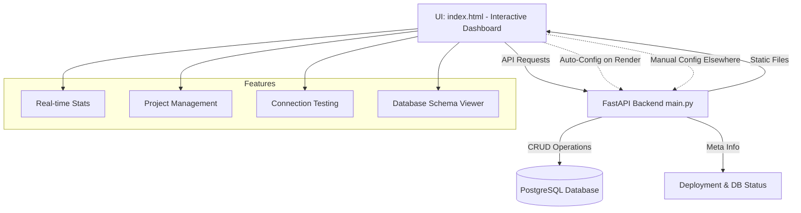

# 📊 CounterAPI


**CounterAPI** is a fully self-hosted API service to track how many times your projects are used.
Powered by **FastAPI** and **PostgreSQL**, it's ideal for hobby projects, dev dashboards, or lightweight analytics.

---

> **See [`USAGE.md`](USAGE.md) for quick curl/API examples!**

---

## 🌟 Features

* 🔁 Track project usage with simple HTTP pings
* 📊 Beautiful interactive dashboard with real-time updates
* 🛠️ Full CRUD: Add, edit, rename, or delete projects with descriptions and counts
* 📂 Persistent storage using **PostgreSQL** (free via Filess.io)
* 🚀 One-click deploy to Render (completely free)
* 🧪 Comes with Postman Collection for quick testing
* 🌐 Auto-configures API URLs when deployed on Render
* 📈 Live stats showing total projects, visits, and averages
* ⚡ Seamless UI updates with debounced reloading
* 🎨 Modern glassmorphism design with smooth animations
* 📱 Fully responsive mobile-friendly interface
* 🔧 Built-in settings modal with connection testing and health checks
* 🗄️ Database schema viewer showing tables, columns, and connection status
* 🛡️ Dark Reader extension disabled for consistent UI experience

---

## 🧐 Architecture Overview

* **Frontend (optional)**: Single-page UI served from Render (index.html)
* **Backend**: FastAPI app handling all API routes
* **Database**: **PostgreSQL** (hosted separately, e.g., on Filess.io)
* **Hosting**: [Render.com](https://render.com) (Free tier)
* **Deployment**: Done via `render.yaml` auto-detected during setup



---

## 🚀 Deploy in Minutes (No Coding Required!)

### 1. Create a Free PostgreSQL Database

- [](https://filess.io/)
- Go to [Filess.io Free Cloud DB Plans](https://filess.io/) and sign up for a free account.
- Create a new PostgreSQL database (choose the latest version if possible).
- Copy your database credentials (host, port, db name, user, password).
- **Or see [this gist for more free cloud DB options](https://gist.github.com/bmaupin/0ce79806467804fdbbf8761970511b8c).**

### 2. Deploy to Render

- Click this button:

[](https://render.com/deploy?repo=https://github.com/Life-Experimentalist/CounterAPI)

- Render will detect `render.yaml` and prompt you for environment variables:
    - `DB_HOST` (e.g. `your-db-host.filess.io`)
    - `DB_PORT` (e.g. `5432` or as given by Filess.io)
    - `DB_NAME` (your database name)
    - `DB_USER` (your database user)
    - `DB_PASS` (your database password)
- Fill in these values from your Filess.io dashboard.
- Choose a service name and region (pick one close to your DB for best speed).
- Click **Create Web Service** and wait for deployment.

That's it! Your API is live and ready to use. No code changes or manual setup required.

---

## 🗄️ Initializing Your Database on Filess.io

> If you are using Filess.io (or similar) for your PostgreSQL database, you must manually create the schema and table before deploying:

> Please refer to [this](https://support.filess.io/hc/wiki/articles/1710108465-how-to-create-a-table-in-postgre_sql-with-web-client) for detailed instructions.

1. **Create your PostgreSQL database** on Filess.io.
2. **Access the web client** from your Filess.io dashboard.
3. **Open a new query tab** (click the `+` at the top right).
4. **Paste and run the following SQL** (click the `>` beside the line numbers to execute):

```sql
CREATE SCHEMA myschema; -- create the schema first (replace 'myschema' with your schema name if desired)

CREATE TABLE myschema.projects (
    name TEXT PRIMARY KEY,
    description TEXT,
    count INTEGER DEFAULT 0
);
```

5. **Refresh the tables list** in the web client to confirm your table is created.
6. **Set the `DB_SCHEMA` environment variable** in Render to match your schema name (e.g., `myschema`).

---

## 📡 API Reference

- `GET /projects` — List all projects with their counts and descriptions
- `POST /projects` — Add a new project (name and optional description)
- `PUT /projects?name={name}` — Update a project's name and/or description
- `DELETE /projects/{name}` — Delete a project by name
- `POST /projects/ping` — Increment a project's count by 1
- `GET /health` — Check API and database connectivity status
- `GET /meta` — View detailed deployment and database info (tables, columns, row counts)
- `GET /` — Serve the interactive dashboard (index.html)

---

## 🧩 Tech Stack

* [FastAPI](https://fastapi.tiangolo.com/) - backend framework
* [PostgreSQL](https://www.postgresql.org/) - [free cloud database](https://www.filess.io)
* [Render](https://render.com/) - free cloud hosting
* [GitHub Pages](https://pages.github.com/) - static site hosting

---

## 🛡️ License

Apache 2.0 – Free for personal, educational, and commercial use.

---

## 🙋‍♀️ Contributing

Want to run locally or contribute?

- Clone the repo and install dependencies:
  ```bash
  git clone https://github.com/Life-Experimentalist/CounterAPI.git
  cd CounterAPI
  pip install -r requirements.txt psycopg2-binary
  ```
- Set up a local PostgreSQL database and configure the environment variables as in the deployment instructions.
- PRs and suggestions are welcome!

---
