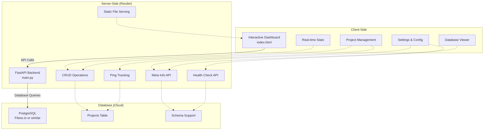

# 🧱 Architecture - CounterAPI

## 🧩 Components Explained

- **Interactive Dashboard**: Modern single-page application with glassmorphism design, real-time stats, and seamless updates
- **FastAPI Backend**: Handles all API endpoints including CRUD operations, ping tracking, health checks, and deployment metadata
- **PostgreSQL Database**: Cloud-hosted database (Filess.io recommended) with schema support and table introspection
- **Render Deployment**: Free cloud hosting with automatic deployment, environment detection, and static file serving
- **Health Check System**: Real-time database connectivity testing with proper status reporting
