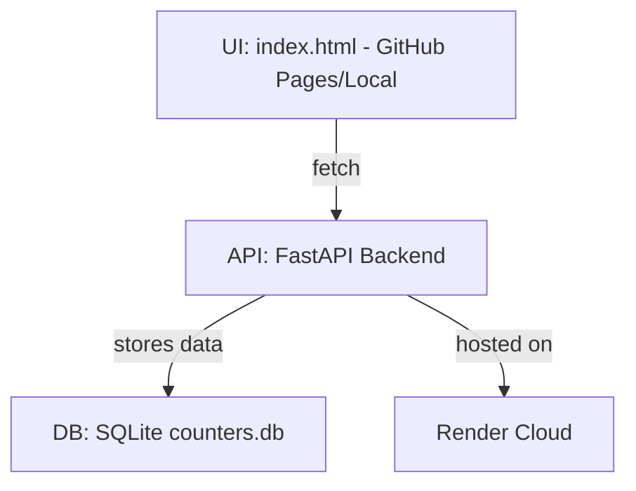

# 🧱 Architecture - ProjectCounter

## 🧩 Components Explained

- **GitHub Pages**: Hosts your static `index.html` UI.
- **FastAPI Backend**: Handles all `/projects`, `/ping`, CRUD endpoints.
- **SQLite (counters.db)**: Persistent local DB file used by backend.
- **Render**: Free cloud host that deploys FastAPI + SQLite service with automatic redeploy from GitHub.
